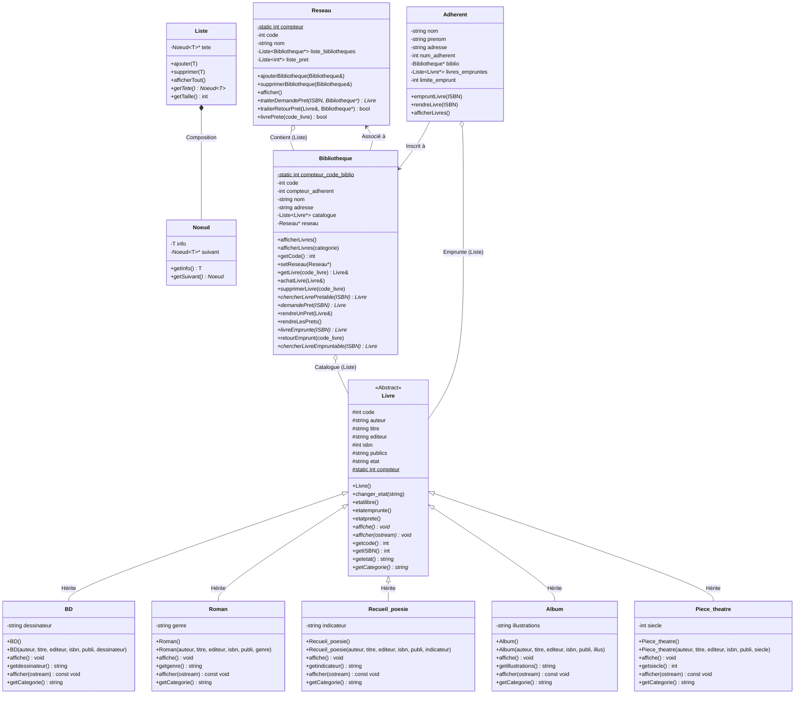

```mermaid
classDiagram
    %% --- RELATIONS D'HÉRITAGE (Polymorphisme) ---
    Livre <|-- BD : Hérite
    Livre <|-- Roman : Hérite
    Livre <|-- Recueil_poesie : Hérite
    Livre <|-- Album : Hérite
    Livre <|-- Piece_theatre : Hérite

    %% --- RELATIONS DE COMPOSITION/AGRÉGATION (Structures) ---
    Liste *-- Noeud : Composition
    
    %% --- RELATIONS ENTRE ENTITÉS PRINCIPALES ---
    Reseau o-- Bibliotheque : Contient (Liste)
    Bibliotheque o-- Livre : Catalogue (Liste)
    Bibliotheque --> Reseau : Associé à
    Adherent --> Bibliotheque : Inscrit à
    Adherent o-- Livre : Emprunte (Liste)

    %% --- DÉFINITION DES CLASSES ---

    class Livre {
        <<Abstract>>
        #int code
        #string auteur
        #string titre
        #string editeur
        #int isbn
        #string publics
        #string etat
        #static int compteur$
        +Livre()
        +changer_etat(string)
        +etatlibre()
        +etatemprunte()
        +etatprete()
        +affiche()* void
        +afficher(ostream)* void
        +getcode() int
        +getISBN() int
        +getetat() string
        +getCategorie()* string
    }

    class Roman {
        -string genre
        +Roman()
        +Roman(auteur, titre, editeur, isbn, publi, genre)
        +affiche() void
        +getgenre() string
        +afficher(ostream) const void
        +getCategorie() string
    }

    class Recueil_poesie {
        -string indicateur
        +Recueil_poesie()
        +Recueil_poesie(auteur, titre, editeur, isbn, publi, indicateur)
        +affiche() void
        +getindicateur() string
        +afficher(ostream) const void
        +getCategorie() string
    }

    class Album {
        -string illustrations
        +Album()
        +Album(auteur, titre, editeur, isbn, publi, illus)
        +affiche() void
        +getillustrations() string
        +afficher(ostream) const void
        +getCategorie() string
    }

    class Piece_theatre {
        -int siecle
        +Piece_theatre()
        +Piece_theatre(auteur, titre, editeur, isbn, publi, siecle)
        +affiche() void
        +getsiecle() int
        +afficher(ostream) const void
        +getCategorie() string
    }

    class BD {
        -string dessinateur
        +BD()
        +BD(auteur, titre, editeur, isbn, publi, dessinateur)
        +affiche() void
        +getdessinateur() string
        +afficher(ostream) const void
        +getCategorie() string
    }

    class Bibliotheque {
        -static int compteur_code_biblio$
        -int code
        -int compteur_adherent
        -string nom
        -string adresse
        -Liste~Livre*~ catalogue
        -Reseau* reseau
        +afficherLivres()
        +afficherLivres(categorie)
        +getCode() int
        +setReseau(Reseau*)
        +getLivre(code_livre) Livre&
        +achatLivre(Livre&)
        +supprimerLivre(code_livre)
        +chercherLivrePretable(ISBN) Livre*
        +demandePret(ISBN) Livre*
        +rendreUnPret(Livre&)
        +rendreLesPrets()
        +livreEmprunte(ISBN) Livre*
        +retourEmprunt(code_livre)
        +chercherLivreEmpruntable(ISBN) Livre*
    }

    class Reseau {
        -static int compteur$
        -int code
        -string nom
        -Liste~Bibliotheque*~ liste_bibliotheques
        -Liste~int*~ liste_pret
        +ajouterBibliotheque(Bibliotheque&)
        +supprimerBibliotheque(Bibliotheque&)
        +afficher()
        +traiterDemandePret(ISBN, Bibliotheque*) Livre*
        +traiterRetourPret(Livre&, Bibliotheque*) bool
        +livrePrete(code_livre) bool
    }

    class Adherent {
        -string nom
        -string prenom
        -string adresse
        -int num_adherent
        -Bibliotheque* biblio
        -Liste~Livre*~ livres_empruntes
        -int limite_emprunt
        +empruntLivre(ISBN)
        +rendreLivre(ISBN)
        +afficherLivres()
    }

    class Liste~T~ {
        -Noeud~T~* tete
        +ajouter(T)
        +supprimer(T)
        +afficherTout()
        +getTete() Noeud~T~*
        +getTaille() int
    }

    class Noeud~T~ {
        -T info
        -Noeud~T~* suivant
        +getInfo() T
        +getSuivant() Noeud*
    }
```