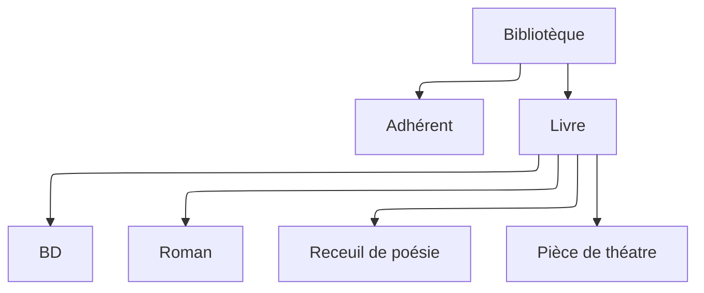

```mermaid
---
config:
  layout: elk
---
flowchart TB
    A["Bibliotèque"] --> n2["Adhérent"] & n3["Livre"]
    n3 --> n4["BD"] & n5["Roman"] & n6["Receuil de poésie"] & n7["Pièce de théatre"]

    n2@{ shape: rect}
  
```