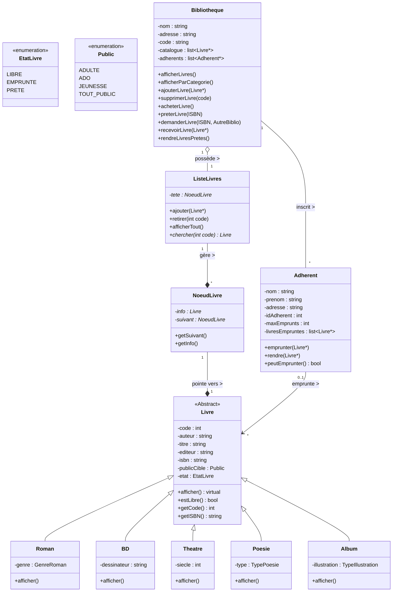

```mermaid
classDiagram
    class EtatLivre {
        <<enumeration>>
        LIBRE
        EMPRUNTE
        PRETE
    }

    class Public {
        <<enumeration>>
        ADULTE
        ADO
        JEUNESSE
        TOUT_PUBLIC
    }

    class Livre {
        <<Abstract>>
        -code : int
        -auteur : string
        -titre : string
        -editeur : string
        -isbn : string
        -publicCible : Public
        -etat : EtatLivre
        +afficher() virtual
        +estLibre() bool
        +getCode() int
        +getISBN() string
    }

    class Roman {
        -genre : GenreRoman
        +afficher()
    }

    class BD {
        -dessinateur : string
        +afficher()
    }

    class Theatre {
        -siecle : int
        +afficher()
    }

    class Poesie {
        -type : TypePoesie
        +afficher()
    }

    class Album {
        -illustration : TypeIllustration
        +afficher()
    }

    class Adherent {
        -nom : string
        -prenom : string
        -adresse : string
        -idAdherent : int
        -maxEmprunts : int
        -livresEmpruntes : list~Livre*~
        +emprunter(Livre*)
        +rendre(Livre*)
        +peutEmprunter() bool
    }

    class Bibliotheque {
        -nom : string
        -adresse : string
        -code : string
        -catalogue : list~Livre*~
        -adherents : list~Adherent*~
        +afficherLivres()
        +afficherParCategorie()
        +ajouterLivre(Livre*)
        +supprimerLivre(code)
        +acheterLivre()
        +preterLivre(ISBN)
        +demanderLivre(ISBN, AutreBiblio)
        +recevoirLivre(Livre*)
        +rendreLivresPretes()
    }

    class NoeudLivre {
        -info : Livre*
        -suivant : NoeudLivre*
        +getSuivant()
        +getInfo()
    }

    class ListeLivres {
        -tete : NoeudLivre*
        +ajouter(Livre*)
        +retirer(int code)
        +afficherTout()
        +chercher(int code) Livre*
    }

    

    %% Relations d'héritage
    Livre <|-- Roman
    Livre <|-- BD
    Livre <|-- Theatre
    Livre <|-- Poesie
    Livre <|-- Album

    %% Relations d'association
    Bibliotheque "1" o-- "1" ListeLivres : possède >
    ListeLivres "1" --* "*" NoeudLivre : gère >
    NoeudLivre "1" --* "1" Livre : pointe vers >
    Bibliotheque "1" -- "*" Adherent : inscrit >
    Adherent "0..1" --> "*" Livre : emprunte >
```